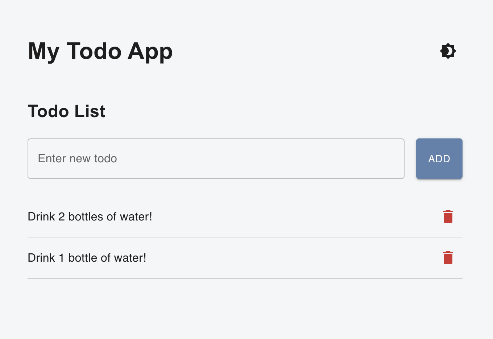
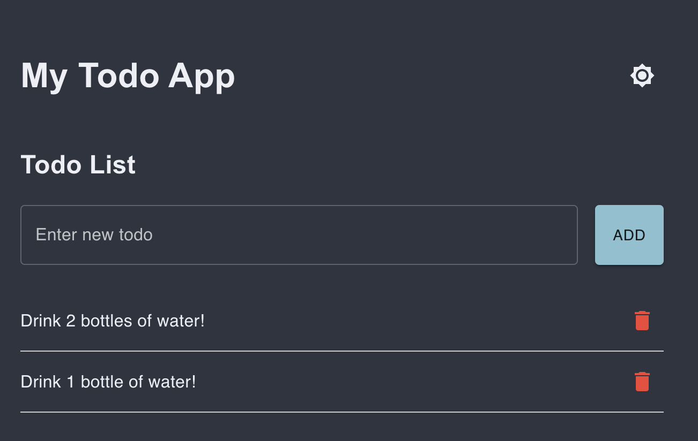

# Fullstack Bootcamp Todo App

A modern, fullstack Todo application built with **React**, **TypeScript**, and **Flask** — designed for learning, experimenting, and improving one step at a time.

---

## 🚀 Features

- ✅ **Create, complete, and delete todos**
- 🌗 **Dark mode toggle** with Nord-inspired color palette
- 🎨 **Custom MUI theming** for consistent styling
- 📦 **RESTful API** built with Python Flask
- 🧪 **Unit tests** for backend and frontend components
- ♻️ **Live reload** during development
- 📄 **Pagination, filtering, and sorting** (if implemented)

---

## 🧰 Tech Stack

### Client
- [React](https://reactjs.org/)
- [TypeScript](https://www.typescriptlang.org/)
- [Material-UI (MUI)](https://mui.com/)
- [Axios](https://axios-http.com/)

### Server
- [Flask](https://flask.palletsprojects.com/)
- [Flask-SQLAlchemy](https://flask-sqlalchemy.palletsprojects.com/)
- [PostgreSQL](https://www.postgresql.org/)

---

## 💻 Getting Started

### 1. Clone the repo

```bash
git clone https://github.com/your-username/fullstack-bootcamp.git
cd fullstack-bootcamp
```

### 2. Set up the backend

```bash
cd server
python3 -m venv venv
source venv/bin/activate
pip install -r requirements.txt
flask db upgrade
flask run
```

### 3. Set up the frontend

```bash
cd client
npm install
npm start
```

---

## 🌙 Dark Mode + Nord Theming

This app includes a **theme toggle** with full support for [Nord colors](https://www.nordtheme.com/):

- `#2E3440` — Polar Night (background)
- `#8FBCBB` — Frost (buttons)
- `#ECEFF4` — Snow Storm (text)
- `#B48EAD` — Aurora (secondary)

Toggle the theme using the 🌞/🌚 button in the header — the UI updates instantly with MUI's theming system.

---

## 🧪 Testing

### Run frontend tests:
```bash
cd client
npm test
```

### Run backend tests:
```bash
cd server
pytest
```

---

## 📁 Project Structure

```
client/
  ├── src/
  │   ├── components/
  │   ├── pages/
  │   ├── theme.ts  ← dark/light mode defined here
  │   └── App.tsx
server/
  ├── app/
  ├── routes/
  ├── models/
  └── run.py
```

---

## 📸 Screenshots

| Light Mode | Dark Mode (Nord) |
|------------|------------------|
|  |  |

---

## 🧠 About This Project

This app was built as part of a **Fullstack Bootcamp** focused on strengthening your frontend and backend skills. Technologies were selected to balance real-world experience with educational clarity.

Every file added, feature tweaked, and bug fixed was part of the learning journey.

---

## 🤝 Credits

Built with guidance from OpenAI's ChatGPT 💬 and a lot of persistence.  
Dark theme inspired by [Nord Theme](https://www.nordtheme.com/).

---

## 📜 License

MIT — feel free to fork and remix.
